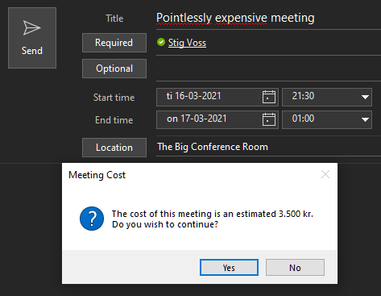

# Meeting Cost Alert
Outlook add-in that displays the cost of a meeting to the organizer when sending a meeting request.

## Features

* Calculate the estimated cost from an hourly rate.
* Calculate the total estimated cost of a recurring meeting.
* Configurable trivial cost threshold which prevents the alert being shown for meeting requests below a certain cost.
* Configurable hourly rate.
* Configurable locale for displaying currencies.